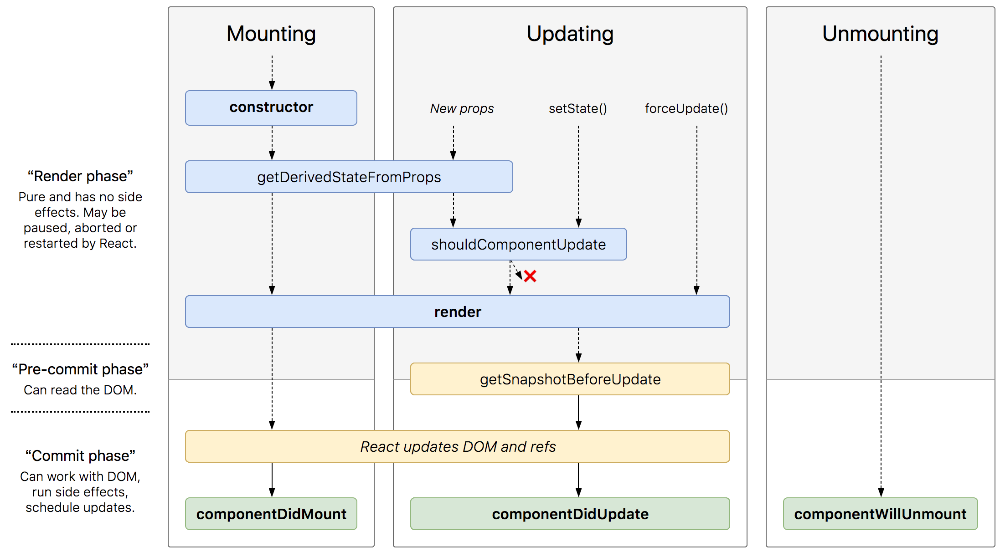

随着 react 16 版本的不断迭代, 更多新的特性也逐渐稳定下来. 本文主要介绍 react 16.3 版本中官方已经稳定下的新版生命周期.

### 新生命周期模型
为了配合异步渲染机制, 并且简化渲染更新流程, react 将去除三种生命周期方法, 加入两种生命周期方法. 在逐渐替换的版本迭代中, 旧版本将方法定位为不安全, 未来将不再继续维护, 预计下一次大版本更新会被废除.

在这个示意图中能够很清晰的看到改版后的组件渲染更新和数据之间的逻辑和生命周期的步骤:

在线查看示意图: [React lifecycle methods diagram](http://projects.wojtekmaj.pl/react-lifecycle-methods-diagram/)

### 计划去除的三个方法
- `componentWillMount`
- `componentWillReceiveProps`
- `componentWillUpdate`

不过在 v16 这个大版本这些方法都不会立刻废除, 有足够时间完成迁移工作, 只是都会增加一个别名( UNSAFE 前缀):
- `componentWillMount` -> `UNSAFE_componentWillMount`
- `componentWillReceiveProps`  -> `UNSAFE_componentWillReceiveProps`
- `componentWillUpdate`  -> `UNSAFE_componentWillUpdate`

在 v16.3 包括之后的 v16版本两种写法你都可以使用, 不过在 v16.3 后面的版本使用旧的方法会得到一个警告. 而在 v17 版本将会彻底去掉旧方法, 只保留 UNSAFE 前缀的兼容方法.

### 新增了两个生命周期方法
- `getDerivedStateFromProps`
- `getSnapshotBeforeUpdate`

**getDerivedStateFromProps**
```js
class Example extends React.Component {
  static getDerivedStateFromProps(nextProps, prevState) {
	  if (...) {
      return null
    }
	  return {
	    counter: prevState.counter++,
      ...
	  }
  }
}
```

随着 `componentWillReceiveProps` 被废除, 接替前者地位的就是这个方法, 而且更加强大,  `componentWillReceiveProps`  只能在初次渲染之后的组件 props 更新时执行, 主要负责渲染之前的数据处理工作, 而 `getDerivedStateFromProps` 有着类似的功能, 但是在初次渲染和组件 props 更新都会被执行. 第一个参数是新传入的 props, 第二个参数是当前的 state. 他的返回和 `setState` 方法类似, 当返回 `null` 时不会更新任何状态, 而有返回的对象就内容是被更新的状态.

值得注意的是, `getDerivedStateFromProps` 是一个静态方法([static - JavaScript | MDN](https://developer.mozilla.org/en-US/docs/Web/JavaScript/Reference/Classes/static)). 它不能直接在非静态方法中使用 this 关键字来访问, 也不能访问到 this 上的方法. 但其实我们没有必要在这个周期使用到 this 上的方法, 一个是我们本来不应该在这个环节进行逻辑处理, 而且实际上这个周期中的所有逻辑处理都可以放到下一个周期去做.

如果你同时用了 `getDerivedStateFromProps` 和 `componentWillReceiveProps`, 那么只有 `getDerivedStateFromProps` 会起作用, 而且还会收到一个警告.

你也可以使用静态方法的写法:
```js
Example.getDerivedStateFromProps = (nextProps, prevState) => {
	return ...
}
```

**getSnapshotBeforeUpdate**
```js
class Example extends React.Component {
  getSnapshotBeforeUpdate(prevProps, prevState) {
    // ...
  }
}
```

这是一个新加入的周期, 基本上替代了方法 `componentWillUpdate`. 它发生在组件被渲染和更新之前的一点点, 是最贴近 VDOM 发生变化之前的一次执行方法. 参数是当前状态的 props, state 值. 他返回的值会被 `componentDidUpdate` 当做第三个参数.

```js
componentDidUpdate(prevProps, prevState, snapshot) {
    if (snapshot !== null) {
		...
    }
  }
```


### StrictMode
在版本迁移中, 我们可以使用官方提供的高亮组件工具来指导我们熟悉新的特性 —— `StrictMode`. 这个不会实际生成 DOM 的工具组件适用于在这个版本过渡阶段的开发环境中, 用于检查其子组件的是否存在问题, 并且高亮有问题的代码. 在 v16.3 中,  `StrictMode` 能够:
- 确定使用了不安全的生命周期的组件
- 高亮旧版不安全的 ref 用法
- 检测意料之外的副作用

```js
<React.StrictMode>
  	<div>
    <ComponentOne />
    <ComponentTwo />
  </div>
</React.StrictMode>
```

### 总结
以上就是 v16.3 生命周期的新特性, 以前的应用逻辑基本都能比较完美的转换成新的周期方法, 而且新周期会对以前代码逻辑规范有一定提升, 逻辑上较之前的逻辑更为清晰, 对于HOC, render props 都能够比较好的支持. 对于更具体场景的迁移方法请看官方提供的一个示例[Update on Async Rendering - React Blog](https://reactjs.org/blog/2018/03/27/update-on-async-rendering.html#examples)
