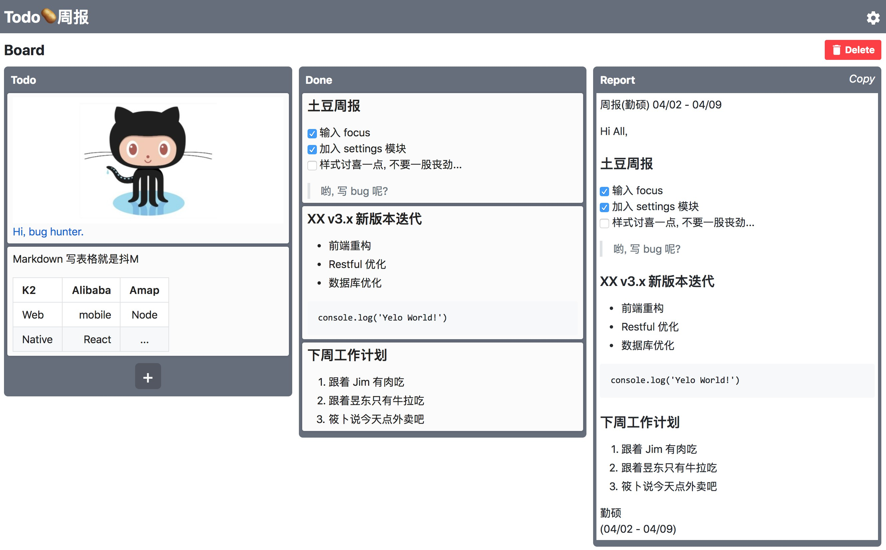

这是一个 *Trello 风格的 Todolist + 根据模板自动生成带时间与签名的周报* 的工具.
(基于 React + Redux. 支持拖拽操作, Markdown, 缓存本地)

为解决我日益增长的忘记写周报以及写周报起来太麻烦的问题, 我做了这个工具帮我自己脱离苦海.用了一段时间, 发觉还不错, 推荐给有缘人使用...

主要能节省下了回忆这周都做了什么, 和每次都要排版, 查日期的重复繁琐操作所浪费的时间.
(只要每次todo完成即可自动规划进入周报模板中).

Todo => Done => 按模板生成周报

[在线地址](https://lqs469.github.io/TodoWeekly/#/)
[Github](https://github.com/lqs469/TodoWeekly)

